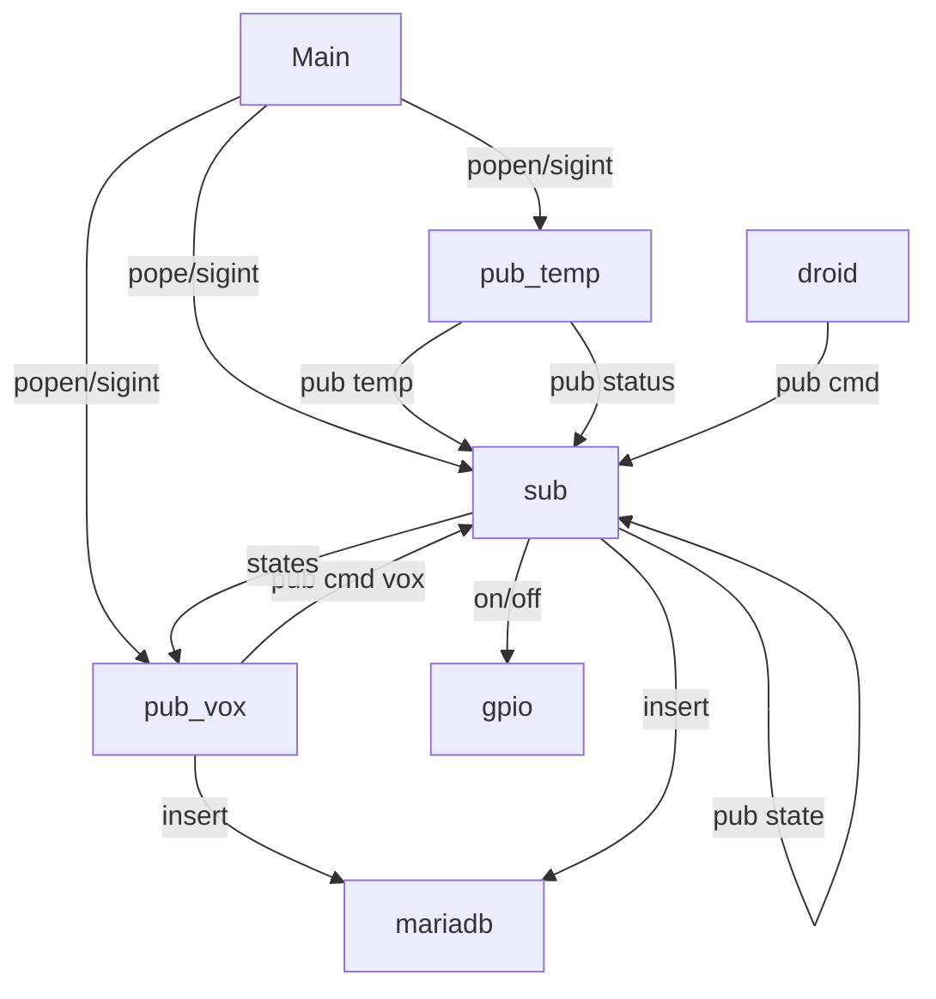

# Projet 1 : Ahuntsic SmartLab

# Table des matières
* [Diagramme d'architecture](#diagramme-darchitecture)
* [Conventions de topics](#conventions-de-topics)
* [Exemples JSON](#exemples-json)
* [Procédure d'installation/exécution](#procédure-dinstallationexécution)
* [Test avec mosquitto_pub/sub](#test-avec-mosquitto-pubsub)
* [Vérifier MariaDB](#vérifier-mariadb)

## Diagramme d'architecture

## Materiels
* Raspberry Pi 4
  * micro-sd 64Gb
  * power supply usb-c
* telephone android pour mqtt dashboard
* Microphone-usb (Sure Mv5 dans mon cas)
  * usb-a a usb-micro-b
* speaker avec 1/8 jack
  * fil 1/8 - 1/8 jack
* breadboard
  * Del blanc comme lampe (led-17)
  * Del rouge comme led-22 (mode nuit)
  * 2 resistances 330 ohms
  * 3 fils m-f
  * 1 fil m-m

## Dependances

* included in python
  * json
  * os
  * platform # pour verifier le systeme d'exploitation
  * random
  * subprocess
  * sys
  * unicodedata
  * datetime : datetime, timezone
  * time
  * signal
* for natural language processing
  * re
  * french_lefff_lemmatizer.french_lefff_lemmatizer : FrenchLefffLemmatizer # pour le lemminizer vs nltk stemmer en francais
  * speech_recognition
* mqtt
  * paho.mqtt.client
* pour gpio operations
  * RPi.GPIO
  * gpiozero : CPUTemperature, LED # pour la temperature et blinker la led
  * Mock.GPIO # pour les tests
* pour mariadb/logging
  * pymysql

from joblib import Memory
## Features

L'object du project est de créer un système de gestion automatique de la maison qui reconnait les commandes vocales et les commandes par dashboard mqtt.

* Le retour vocal raiser d'utiliser des voix préenregistré avant d'utiliser la voix tts pour un melange de qualite, performance et flexibilite
* Le lemmatizer est un specialize en français qui aide à améliorer les résultats vs nltk mais fonctionne de conceptuellement pareil
* la fonction de normalisation réduit les mots inutiles et cache les mots pour éviter les repetitions et améliorer la vitesse
* dans le futur les commandes precedents pourraient aussi être aussi sauve en cache avec leur lemma pour aussi ameliorate les résultats
* Vox
  * les hot words acceptee sont : "Bonjour", "Maison"
  * les commandes de object sont: "état", "etats", "status", "statut", "mode", "nuit", "temperature", "cpu", "lumiere", "lampe", "del", "led"
  * les commandes de state: "allumer", "on", "activer", "active", "allume", "desactiver", "off", "eteint", "eteins", "etein", "cligne", "clignote", "scintille"
  * les actions sont : 
    * allumer/eteindre/clignoter la led-17 blanche, 
    * allumer/eteindre la led-22 qui symbolise le mode nuit.
    * demander l'état de chaque led (mode nuit, ou par défaut seulement état donne la led-17)
    * demander l'état de la temperature cpu
  * les commandes peuvent fonctionner par voix ou par dashboard

par example: 

"allume la lampe": allume la lampe si elle est ferme
"active le mode nuit": active la led-22 qui symbolise le mode nuit
"etat lampe": donne un retour vocal pour le status de la led-17

## Conventions de topics

les topics sont: ahunsic/aec-iot/"groupe"/"nom-du-device-pub"/"type"/...

TOPICS :
  ### temperature
  "temperature": "ahuntsic/aec-iot/b42/pi01/sensors/temperature"
  "temperature_brut": "ahuntsic/aec-iot/b42/pi01/sensors/temperature/value"

  ### presence clients
  "presence": "ahuntsic/aec-iot/b42/pi01/status/online"
  "presence_voix": "ahuntsic/aec-iot/b42/pi01/status/voix"
  
  ### mode nuit
  "mode_nuit": "ahuntsic/aec-iot/b42/pi01/actuators/nuit/cmd"
  "mode_nuit_status": "ahuntsic/aec-iot/b42/pi01/actuators/nuit/state"
  
  ### led
  "led_command": "ahuntsic/aec-iot/b42/droid01/actuators/led/cmd"
  "led_status": "ahuntsic/aec-iot/b42/pi01/actuators/led/state"
  "led_cling": "ahuntsic/aec-iot/b42/pi01/actuators/led/cling"
  
  ### other
  "other" : "ahuntsic/aec-iot/b42/other"
  
  ### voix pour logging
  "vox": "maison/voix"

## Exemples JSON

Pour une mesure capteur :

{

"device": "b42-pi01", 

"sensor": "temperature", 

"value": 51.608, 

"unit": "C", 

"ts": "2026-03-27 19:07:04"

}

Pour l'etat dun del:

{

"device": "b42-pi01", 

"actuator": "led-17", 

"state": "OFF", 

"ts": "2026-03-27 19:00:37"

}

Pour un action:

{

"state": "OFF"

} 

Pour un état:

{

"presence": "online"

} 

## Procédure d'installation/exécution

Installer une instance de MariaDB mosquitto et mosquitto clients et faire le setup

Peut essayer run sudo python3 inst_mdb.py dans le projet plus tard aussi
(il a seulement besoin d'utiliser sudo pour installer les programmes)

creer/naviguer au project folder

    mkdir /home/[user]/.git/Projet2-Ahuntsic-SmartLab
    cd /home/[user]/.git/Projet2-Ahuntsic-SmartLab
    git clone https://github.com/gab55/projet2-ahuntsic-smartlab.git

pull from github main si besoin

    git pull https://github.com/gab55/projet2-ahuntsic-smartlab.git

ajouter un venv avec les dépendances

    source .venv/bin/activate
    pip install -r requirements.txt

configurer le dashboard sur le telephone android avec les topics

pour démarrer le programme python3 main.py 

    python3 main.py

Ou démarrer les clients séparément avec 

    python3 src/publisher_sensor.py
    python3 src/subscriber_led.py
    python3 src/publisher_voix.py

## Test avec Mosquitto pub/sub

Une fois le publisher est active

Le suscriber reçoit les messages auxquels il est souscrit

## Vérifier MariaDB

example de requetes de base pour verifier les deux tables

celle ci montre le moyenne de temperature pour chaque heure de chaque jour

