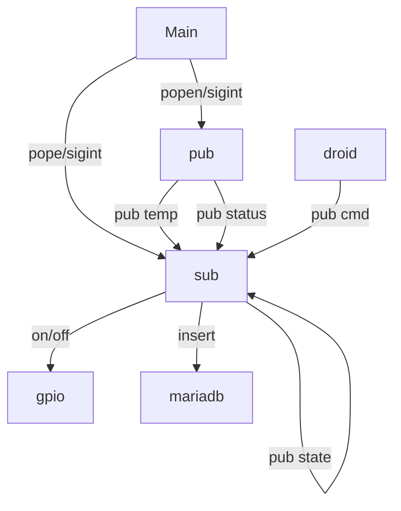

# Projet 1 : Ahuntsic SmartLab

# Table des matières
* [Diagramme d'architecture](#diagramme-darchitecture)
* [Conventions de topics](#conventions-de-topics)
* [Exemples JSON](#exemples-json)
* [Procédure d'installation/exécution](#procédure-dinstallationexécution)
* [Test avec mosquitto_pub/sub](#test-avec-mosquitto-pubsub)
* [Vérifier MariaDB](#vérifier-mariadb)

## Diagramme d'architecture

## Conventions de topics

les topics sont: ahunsic/aec-iot/"groupe"/"nom-du-pi"/"type"/...

TOPICS :
  "temperature": "ahuntsic/aec-iot/b42/pi01/sensors/temperature"
  
  "temperature_brut": "ahuntsic/aec-iot/b42/pi01/sensors/temperature/value"
  
  "presence": "ahuntsic/aec-iot/b42/pi01/status/online"
  
  "led_status": "ahuntsic/aec-iot/b42/pi01/actuators/led/state"
  
  "led_command": "ahuntsic/aec-iot/b42/droid01/actuators/led/cmd"
  
  "other" : "ahuntsic/aec-iot/b42/other"

## Exemples JSON

Pour une mesure capteur :

{

"device": "b42-pi01", 

"sensor": "temperature", 

"value": 51.608, 

"unit": "C", 

"ts": "2026-03-27 19:07:04"

}

Pour l'etat dun del:

{

"device": "b42-pi01", 

"actuator": "led-17", 

"state": "OFF", 

"ts": "2026-03-27 19:00:37"

}

Pour un action:

{

"state": "OFF"

} 

Pour un etat:

{

"presence": "online"

} 

## Procédure d'installation/exécution

besoin d'installer un instance de MariaDB mosquitto et mosquitto clients et faire le setup

peut essayer run sudo python3 inst_mdb.py dans le projet plus tard aussi
(seuelment besoin d'utiliser sudo pour installer les programmes)

creer/naviguer au project folder

pull from github main si besoin

ajouter un venv avec les dependances

configurer le dashboard

pour demarer le programme python3 main.py

## Test avec Mosquitto pub/sub

Une fois le publisher est active

Le suscriber reçoit les messages auxquels il est souscrit

## Vérifier MariaDB

example de requetes de base pour verifier les deux tables

celle ci montre le moyenne de temperature pour chaque heure de chaque jour

